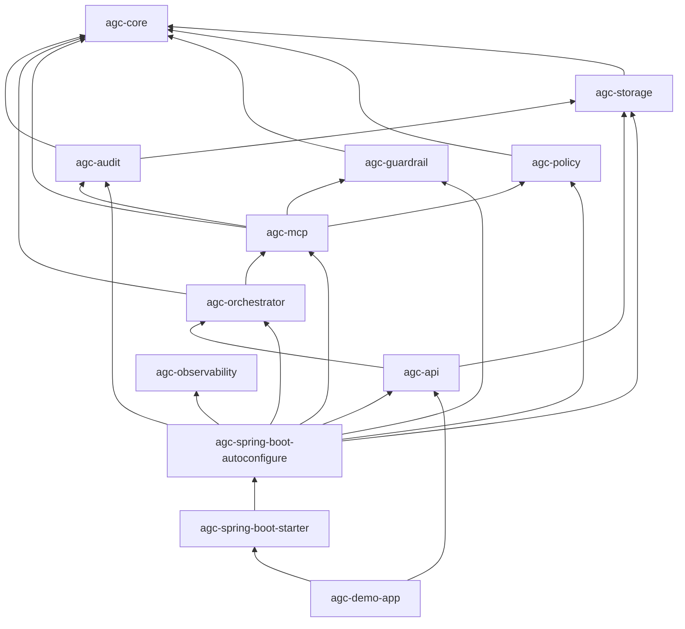

# AGC — architecture & reference

How the repo is structured: modules, auto-configuration order, governance behavior, and how to run the demo.

---

## Module graph



- **Starter** → **`agc-spring-boot-autoconfigure`** only; that module pulls feature JARs and registers all `@AutoConfiguration` classes.
- **`McpToolExecutor`** is **`com.framework.agent.mcp.internal`** (not public `agc-core` API). ArchUnit enforces gateway-only execution paths.

---

## Packages (summary)

| Area | Package | Module |
|------|---------|--------|
| Domain + gateway SPI | `com.framework.agent.core` | **agc-core** (no Spring) |
| JPA / Flyway | `com.framework.agent.storage` | agc-storage |
| Audit | `com.framework.agent.audit` | agc-audit |
| Policy / guardrails | `com.framework.agent.policy`, `..guardrail` | agc-policy, agc-guardrail |
| Pipeline + gateway | `com.framework.agent.mcp` | agc-mcp |
| MCP adapter SPI | `com.framework.agent.mcp.internal` | agc-mcp |
| Spring wiring | `com.framework.agent.autoconfigure` | agc-spring-boot-autoconfigure |
| REST (optional) | `com.framework.agent.api.web` | agc-api |

---

## Auto-configuration order

All live in **`agc-spring-boot-autoconfigure`**, file:

`META-INF/spring/org.springframework.boot.autoconfigure.AutoConfiguration.imports`

Chain: **Storage** (after `DataSourceAutoConfiguration`) → **Audit** → **Policy** → **Guardrail** → **MCP** → **Orchestrator** → **Observability** (if `MeterRegistry`) → **Web** (if REST classes on classpath).

---

## Governance (runtime)

- Gateway requires **non-blank `traceId` and `toolName`**; pipeline returns a **non-null** decision; **`DecisionType.DENY`** → no tool execution.
- Failed required audit writes → **`GovernedPathAuditException`** (fail-closed). **`agc.audit.strict-secondary-audit`** (default `true`) controls strict handling after tool errors.
- Evaluator exceptions → **DENY** with stable reason codes.

---

## Request path

`AgentOrchestrator` → **`ToolInvocationGateway`** → **policy → guardrails** → (if not DENY) internal executor → **`AuditRecorder`**.

---

## Build & run

| Goal | Command |
|------|---------|
| Build + tests | `mvn clean verify` |
| Demo (from repo root) | `mvn -pl agc-demo-app -am spring-boot:run` |

Use **`-am`** so sibling modules build in the reactor; otherwise install snapshots with `mvn install` from root first.

---

## Configuration (`agc.*`)

| Key | Role |
|-----|------|
| `agc.policy.roles` | Role → allowed tools (`"*"` = all) |
| `agc.guardrails.rules` | `id`, `toolName`, `action` (`DENY` / `WARN`) |
| `agc.llm.planned-tool-name` | Stub LLM default tool |
| `agc.audit.max-payload-chars` | Bound stored payload text |
| `agc.audit.strict-secondary-audit` | Default `true`: fail if `SYSTEM_ERROR` audit cannot be written after tool failure |

Example: `agc-demo-app/src/main/resources/application.yml`.

---

## HTTP (demo, port 8080)

```bash
curl -s -X POST http://localhost:8080/agent/execute \
  -H 'Content-Type: application/json' \
  -d '{"principalId":"u1","roles":["user"],"message":"hello"}'
```

- **`GET /audit/{traceId}`** — audit trail for that trace.
- **Demo UI:** `GET /` · **`GET /demo/scenarios`** · **`POST /demo/run`** with `{"scenario":"<id>"}`.
- Stub LLM: **`[[tool:name]]`** in the message, or scenario overrides in `/demo/run`.

---

## Troubleshooting

| Symptom | Check |
|---------|--------|
| Build can’t find modules | `mvn -pl agc-demo-app -am …` or `mvn install` from root |
| 403 with `reasonCode` | Policy roles vs tool; guardrail rules |
| Audit / DB errors | Datasource, Flyway, DB reachability |
| Invalid auto-config at startup | Clean build; autoconfigure lives only in **`agc-spring-boot-autoconfigure`** |

---

## Integration notes

- Add **`agc-api`** for REST. For headless use, **`agc-spring-boot-starter`** only.
- In production, bind **identity** from your auth layer, not untrusted JSON fields.

Dependency:

```xml
<dependency>
  <groupId>com.framework.agent</groupId>
  <artifactId>agc-spring-boot-starter</artifactId>
  <version>0.1.0-SNAPSHOT</version>
</dependency>
```

(Publish to Maven Central / GitHub Packages is separate from cloning and `mvn install`.)
