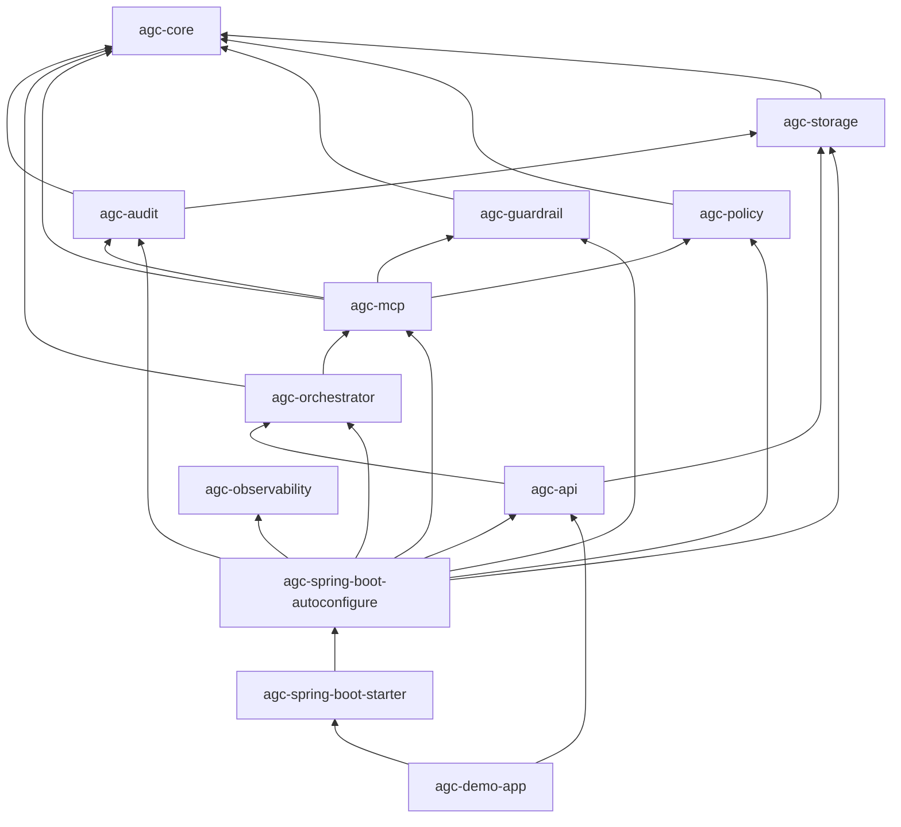

# AGC — architecture & reference

How the repo is structured: modules, auto-configuration order, runtime wiring, and how to run the demo.

**Also see:** [LIBRARY.md](LIBRARY.md) (Maven name, why adopt, discoverability), [USAGE.md](USAGE.md) (feature usage, sequence, data, exceptions), [GOVERNANCE.md](GOVERNANCE.md) (decisions, reason codes), [FAILURE_MODES.md](FAILURE_MODES.md) (audit modes, failures), [QUICKSTART.md](QUICKSTART.md) (minimal app).

---

## Module graph



- **Starter** → **`agc-spring-boot-autoconfigure`** only; that module pulls feature JARs and registers all `@AutoConfiguration` classes.
- **`McpToolExecutor`** is **`com.framework.agent.mcp.internal`** (not public `agc-core` API). ArchUnit enforces gateway-only execution paths.

---

## Packages (summary)

| Area | Package | Module |
|------|---------|--------|
| Domain + gateway SPI | `com.framework.agent.core` | **agc-core** (no Spring) |
| JPA / Flyway | `com.framework.agent.storage` | agc-storage |
| Audit | `com.framework.agent.audit` | agc-audit |
| Policy / guardrails | `com.framework.agent.policy`, `..guardrail` | agc-policy, agc-guardrail |
| Pipeline + gateway | `com.framework.agent.mcp` | agc-mcp |
| MCP adapter SPI | `com.framework.agent.mcp.internal` | agc-mcp |
| Spring wiring | `com.framework.agent.autoconfigure` | agc-spring-boot-autoconfigure |
| REST (optional) | `com.framework.agent.api.web` | agc-api |

---

## Auto-configuration order

All live in **`agc-spring-boot-autoconfigure`**, file:

`META-INF/spring/org.springframework.boot.autoconfigure.AutoConfiguration.imports`

Chain: **Storage** (after `DataSourceAutoConfiguration`) → **Audit** → **Policy** → **Guardrail** → **MCP** (ToolRegistry + gateway + executor) → **Orchestrator** → **Observability** (if `MeterRegistry`) → **Web** (if REST classes on classpath).

---

## Governance (runtime)

- **Trusted entry point:** **`ToolInvocationGateway`** only; internal **`McpToolExecutor`** is blocked outside the gateway (**`GatewayContextHolder`**, ArchUnit). Direct call → **`IllegalStateException`**: **"Direct execution forbidden"**.
- **Governance pipeline:** registry (optional allowlist) → policy → guardrails → execution; **`DecisionType.DENY`** → no tool execution. Decisions and reason codes: [GOVERNANCE.md](GOVERNANCE.md).
- **Tool registry (first):** `agc.tools.allowed`; logical names and **`tool:vN`**: see **Tool versioning** below. Unknown tool → **`TOOL_NOT_REGISTERED`** before policy.
- **Kill switch:** `agc.enabled: false` → **`AGC_DISABLED`**. Audit behavior by mode: [FAILURE_MODES.md](FAILURE_MODES.md).
- **`agc.governance.mode`:** **`DEVELOPMENT`** \| **`STAGING`** \| **`PRODUCTION`**. **`PRODUCTION`** → **`POST /agent/execute`** returns **401** without authenticated Spring Security principal.
- **`agc.audit.mode`:** **`STRICT`** \| **`ASYNC`** \| **`BEST_EFFORT`** — see [FAILURE_MODES.md](FAILURE_MODES.md). **`agc.audit.strict-secondary-audit`** (default `true`) applies to **`SYSTEM_ERROR`** after tool failure in **STRICT**.

### Conceptual execution lifecycle (audit + gateway)

Logical phases (not a separate state machine in code): **authorize** (registry + policy + guardrails) → **execute** (internal MCP adapter) → **audit** (request/response/error per `agc.audit.mode`). Invalid paths end in **DENY** + audit when persistence allows.

### Tool versioning

Use **`logicalName:vN`** (e.g. `search:v1`). Policy, registry, and guardrails compare **`ToolNames.logicalName`** so allowlists and role bindings can stay on **`search`** while callers pass **`search:v2`**.

### Observability & OpenTelemetry

MDC carries **`traceId`**, **`correlationId`**, **`principalId`**, **`toolName`**, **`decision`**, **`reasonCode`**, **`executionTimeMs`**. Micrometer timers/counters are registered when a **`MeterRegistry`** bean exists; in full Spring Boot stacks, pair **Micrometer + OTLP** / **Spring Boot 3 observability** to export traces to OpenTelemetry without changing gateway code.

---

## Request path

`AgentOrchestrator` → **`ToolInvocationGateway`** → **ToolRegistry** (allowlist / `TOOL_NOT_REGISTERED`) → **policy** → **guardrails** → (if not DENY) internal executor → **`AuditRecorder`**.

---

## Build & run

| Goal | Command |
|------|---------|
| Build + tests | `mvn clean verify` |
| Demo (from repo root) | `mvn -pl agc-demo-app -am spring-boot:run` |

Use **`-am`** so sibling modules build in the reactor; otherwise install snapshots with `mvn install` from root first.

---

## Configuration (`agc.*`)

| Key | Role |
|-----|------|
| `agc.enabled` | Global kill switch (`false` = deny all tool executions) |
| `agc.governance.mode` | `DEVELOPMENT` \| `STAGING` \| `PRODUCTION` (HTTP `401` when `PRODUCTION` and unauthenticated) |
| `agc.tools.allowed` | Optional allowlist of tool names; empty = no extra registry filter |
| `agc.policy.roles` | Role → allowed tools (`"*"` = all) |
| `agc.guardrails.rules` | `id`, `toolName`, `action` (`DENY` / `WARN`) |
| `agc.llm.planned-tool-name` | Stub LLM default tool |
| `agc.audit.mode` | `STRICT` \| `BEST_EFFORT` \| `ASYNC` (async executor bean) |
| `agc.audit.max-payload-chars` | Bound stored payload text |
| `agc.audit.hash-payload` | Optional SHA-256 payload hash (`false` by default) |
| `agc.audit.strict-secondary-audit` | Default `true`: fail if `SYSTEM_ERROR` audit cannot be written after tool failure when mode is `STRICT` |

Example: `agc-demo-app/src/main/resources/application.yml`.

---

## HTTP (demo, port 8080)

```bash
curl -s -X POST http://localhost:8080/agent/execute \
  -H 'Content-Type: application/json' \
  -d '{"traceId":"t-1","correlationId":"c-1","principalId":"u1","roles":["user"],"message":"hello"}'
```

- **`GET /audit/{traceId}`** — audit trail for that trace.
- **Demo UI:** `GET /` · **`GET /demo/scenarios`** (each item has `id`, `description`, `group`) · **`POST /demo/run`** with `{"scenario":"<id>"}`.
- Stub LLM: **`[[tool:name]]`** or **`[[tool:name:vN]]`** in the message, or scenario thread override for the planned tool.

### Demo scenarios (`DemoScenario`)

| `group` | Scenario id | What it shows |
|---------|----------------|----------------|
| `success` | `allow_search` | Allowed tool for role `user`; audit trail |
| `success` | `allow_search_versioned` | Planned `search:v2` — registry uses logical `search` |
| `success` | `allow_read_with_warn` | Guardrail `WARN` on `read`; tool still runs |
| `registry` | `unknown_tool_not_registered` | Tool not in `agc.tools.allowed` → `TOOL_NOT_REGISTERED` |
| `policy` | `policy_deny_forbidden_tool` | Role lacks tool → `POLICY_TOOL_FORBIDDEN` |
| `policy` | `policy_deny_no_roles` | No roles → `POLICY_NO_ROLES` |
| `guardrail` | `guardrail_deny_payment` | Guardrail `DENY` on `payment_api` |

---

## Troubleshooting

| Symptom | Check |
|---------|--------|
| Build can’t find modules | `mvn -pl agc-demo-app -am …` or `mvn install` from root |
| 403 with `reasonCode` | Policy roles vs tool; guardrail rules |
| Audit / DB errors | Datasource, Flyway, DB reachability |
| Invalid auto-config at startup | Clean build; autoconfigure lives only in **`agc-spring-boot-autoconfigure`** |

## Production operations notes

- Keep policy / guardrail evaluators CPU-only and non-blocking; network calls in evaluators increase governance latency and failure blast radius.
- Default recommendation: `agc.audit.mode=STRICT` for regulated production; use `ASYNC` only with queue/backpressure monitoring.
- Typical datasource baseline for audit-heavy services (Hikari):
  - `spring.datasource.hikari.maximum-pool-size: 20`
  - `spring.datasource.hikari.minimum-idle: 5`
  - `spring.datasource.hikari.connection-timeout: 30000`
  - tune per deployment throughput and DB limits.
- Key metrics:
  - `agc_decisions_total{decision,reasonCode}`
  - `agc_gateway_latency_ms{outcome}`
  - `agc_audit_write_failures_total`
  - `agc_audit_latency_ms`

---

## Integration notes

- Add **`agc-api`** for REST. For headless use, **`agc-spring-boot-starter`** only.
- In production, bind **identity** from your auth layer, not untrusted JSON fields.

Dependency:

```xml
<dependency>
  <groupId>com.framework.agent</groupId>
  <artifactId>agc-spring-boot-starter</artifactId>
  <version>1.0.0</version>
</dependency>
```

(Publish to Maven Central / GitHub Packages is separate from cloning and `mvn install`.)
