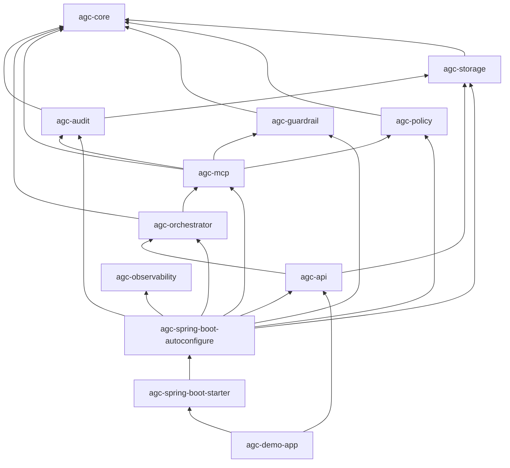

# AGC — architecture (implementation)

This document describes **how the repository is structured today**: Maven modules, Java packages, Spring Boot auto-configuration, and the request path through governance.

Design goals (single gateway, policy → guardrails, append-only audit) are summarized in this file and in [RUNBOOK.md](RUNBOOK.md).

---

## Module dependency graph

- **agc-spring-boot-starter** depends **only** on **`agc-spring-boot-autoconfigure`**, which pulls feature JARs and registers every `@AutoConfiguration`.
- **`McpToolExecutor`** is **`com.framework.agent.mcp.internal`** — not part of the public `agc-core` API; ArchUnit enforces that only the gateway (and Spring autoconfigure wiring) may use it.
- **agc-api** is **optional** at runtime (`AgcWebAutoConfiguration` is `@ConditionalOnClass` for REST controllers).

---

## Package map

| Area | Package | Module |
|------|---------|--------|
| Domain types and SPIs (`GovernanceDecision`, `ToolInvocationGateway`, `AuditRecorder`, …) | `com.framework.agent.core` | **agc-core** (no Spring) |
| JPA entities, Flyway, sequence service | `com.framework.agent.storage` | agc-storage |
| `JpaAuditRecorder`, audit properties | `com.framework.agent.audit` | agc-audit |
| Role to tools policy | `com.framework.agent.policy` | agc-policy |
| Guardrail rules | `com.framework.agent.guardrail` | agc-guardrail |
| Pipeline, gateway | `com.framework.agent.mcp` | agc-mcp |
| MCP adapter SPI (internal) | `com.framework.agent.mcp.internal` | agc-mcp |
| Spring Boot wiring | `com.framework.agent.autoconfigure` | agc-spring-boot-autoconfigure |
| Orchestrator, stub LLM | `com.framework.agent.orchestrator` | agc-orchestrator |
| Observability placeholder | `com.framework.agent.observability` | agc-observability |
| REST controllers | `com.framework.agent.api.web` | agc-api |

---

## Auto-configuration registration

All AGC `@AutoConfiguration` classes live in **`agc-spring-boot-autoconfigure`** under `com.framework.agent.autoconfigure`, listed in:

`agc-spring-boot-autoconfigure/src/main/resources/META-INF/spring/org.springframework.boot.autoconfigure.AutoConfiguration.imports`

**Order (each `@AutoConfigureAfter` the previous):**

1. `AgcStorageAutoConfiguration` — after `DataSourceAutoConfiguration`
2. `AgcAuditAutoConfiguration` — after storage
3. `AgcPolicyAutoConfiguration` — after audit
4. `AgcGuardrailAutoConfiguration` — after policy
5. `AgcMcpAutoConfiguration` — after guardrail and audit
6. `AgcOrchestratorAutoConfiguration` — after MCP
7. `AgcObservabilityAutoConfiguration` — after orchestrator (conditional on `MeterRegistry`)
8. `AgcWebAutoConfiguration` — after orchestrator (conditional on REST controllers class)

Feature modules **do not** ship their own `AutoConfiguration.imports` files.

---

## Governance hardening (runtime)

- **`DefaultToolInvocationGateway`** validates **non-blank `traceId` and `toolName`**, requires a **non-null** pipeline decision, persists **GOVERNANCE_DECISION** before branching, and uses **`decision.type() == DENY`** before any tool call.
- **Audit failures** on the governed path throw **`GovernedPathAuditException`** (fail-closed). Secondary **`SYSTEM_ERROR`** audit after a tool failure uses **`agc.audit.strict-secondary-audit`** (default `true`) to fail closed or relax only that write.
- **`DefaultGovernancePipeline`** maps evaluator exceptions to **DENY** (`GOVERNANCE_EVALUATION_FAILED`) and treats null policy decisions as **DENY** (`GOVERNANCE_CONTRACT_VIOLATION`).

---

## Runtime request path (REST demo)

1. `POST /agent/execute` calls `AgentOrchestrator` (`agc-orchestrator`).
2. The orchestrator invokes **`ToolInvocationGateway`** (`agc-mcp`).
3. The gateway runs **`GovernancePipeline`**: **policy** then **guardrails**; **`DecisionType.DENY`** ends without calling **`McpToolExecutor`**.
4. **ALLOW** / **WARN** leads to internal tool execution then **`AuditRecorder`** persisting audit rows via **`agc-storage`**.
5. `GET /audit/{traceId}` reads ordered events from the repository.

---

## Consumer integration

- **Headless (library):** depend on `agc-spring-boot-starter` only; call `ToolInvocationGateway` or orchestrator beans from your code.
- **REST:** add `agc-api`.
- **Identity:** supply `principalId` and `roles` from your security layer; the demo accepts JSON fields for local testing only.

See [CHEAT_SHEET.md](CHEAT_SHEET.md) for properties and curl examples.
