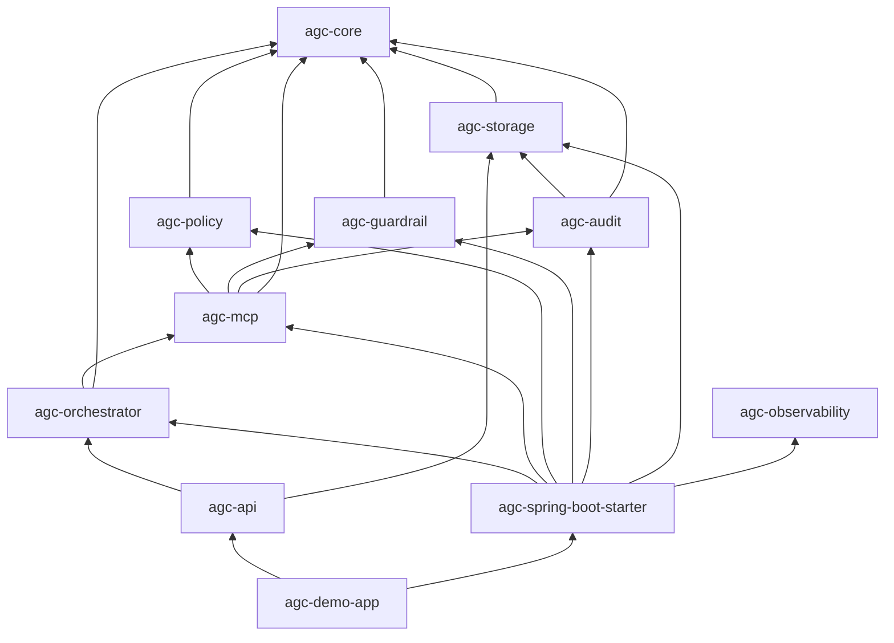

# AGC — architecture (implementation)

This document describes **how the repository is structured today**: Maven modules, Java packages, Spring Boot auto-configuration, and the request path through governance.

**Canonical product contract** (invariants, phases, failure semantics): [PRODUCT_DEVELOPMENT_PLAN.md](PRODUCT_DEVELOPMENT_PLAN.md).

---

## Module dependency graph

- **agc-spring-boot-starter** is a **POM-only aggregator**: it declares dependencies on the feature modules. It does **not** register its own `AutoConfiguration` class (each feature module ships `META-INF/spring/org.springframework.boot.autoconfigure.AutoConfiguration.imports`).
- **agc-api** is **optional**: add it when you want `AgentExecuteController` and `AgcWebAutoConfiguration`.

---

## Package map

| Area | Package | Module |
|------|---------|--------|
| Domain types and SPIs (`GovernanceDecision`, `ToolInvocationGateway`, `AuditRecorder`, …) | `com.framework.agent.core` | **agc-core** (no Spring) |
| JPA entities, Flyway, sequence service | `com.framework.agent.storage` | agc-storage |
| `JpaAuditRecorder`, audit properties | `com.framework.agent.audit` | agc-audit |
| Role to tools policy | `com.framework.agent.policy` | agc-policy |
| Guardrail rules | `com.framework.agent.guardrail` | agc-guardrail |
| Pipeline, gateway, MCP executor adapter | `com.framework.agent.mcp` | agc-mcp |
| Orchestrator, stub LLM | `com.framework.agent.orchestrator` | agc-orchestrator |
| Micrometer hooks | `com.framework.agent.observability` | agc-observability |
| REST controllers | `com.framework.agent.api.web` | agc-api |

---

## Auto-configuration registration

Each module lists one or more `@AutoConfiguration` classes in:

`src/main/resources/META-INF/spring/org.springframework.boot.autoconfigure.AutoConfiguration.imports`

Spring Boot merges all entries from the classpath. Ordering between AGC modules is enforced with `@AutoConfigureAfter` / `@AutoConfigureBefore` on those classes (for example storage after `DataSourceAutoConfiguration`, audit after storage, MCP after policy, guardrail, and audit).

**Do not** add a monolithic `AgcAutoConfiguration` in the starter unless you also ship the class; stale `AutoConfiguration.imports` entries cause startup failures (`Unable to read meta-data for class …`).

---

## Runtime request path (REST demo)

1. `POST /agent/execute` calls `AgentOrchestrator` (`agc-orchestrator`).
2. The orchestrator invokes **`ToolInvocationGateway`** (`agc-mcp`).
3. The gateway runs **`GovernancePipeline`**: **policy** then **guardrails**; **DENY** returns without calling `McpToolExecutor`.
4. **ALLOW** / **WARN** leads to tool execution then **`AuditRecorder`** persisting audit rows via **`agc-storage`**.
5. `GET /audit/{traceId}` reads ordered events from the repository.

---

## Consumer integration

- **Headless (library):** depend on `agc-spring-boot-starter` only; call `ToolInvocationGateway` or orchestrator beans from your code.
- **REST:** add `agc-api`.
- **Identity:** supply `principalId` and `roles` from your security layer; the demo accepts JSON fields for local testing only.

See [CHEAT_SHEET.md](CHEAT_SHEET.md) for properties and curl examples.
