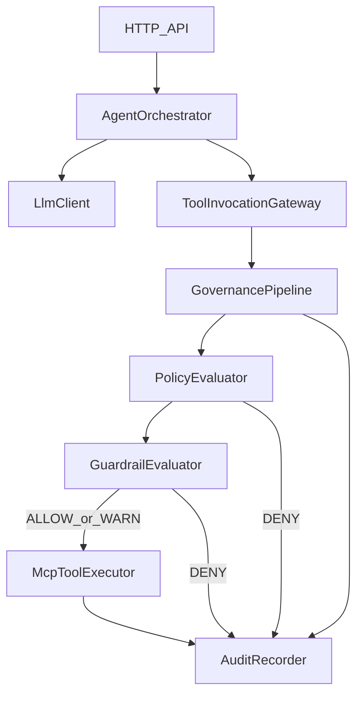
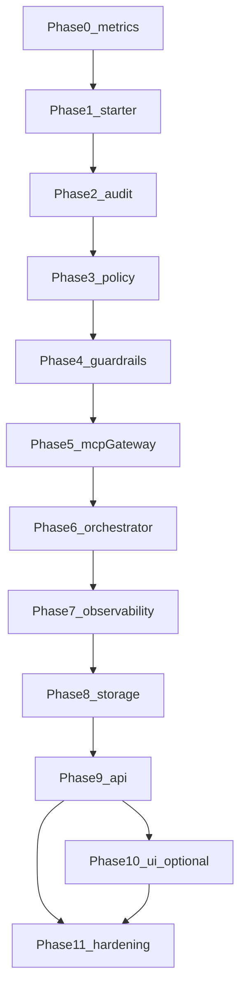

# Agent Governance & Control — full product development (phase by phase)

This document is the canonical **build sequence** and **architecture contract** for the framework: one Spring Boot starter (`agc-spring-boot-starter`), gap-first features, production-quality gates, and **enforceable** governance semantics (no bypass, explainable decisions, bounded audit).

**Contents:** [Principles](#product-principles-apply-to-every-phase) · [Invariants & flows](#architectural-invariants) · [Decision semantics](#decision-semantics-allow--deny--warn) · [Core contracts](#core-contracts-java-style) · [Failure modes](#failure-modes--recovery) · [Performance](#performance--scalability) · [Security](#security--safety) · [MVP scope](#mvp-scope-strict) · [Phases 0–11](#phase-checklist-tracking) · [Dependency graph](#dependency-graph-high-level)

---

## Product principles (apply to every phase)

- **Gap-first:** Every phase maps to a concrete user pain (traceability, tool authorization, operability)—not feature sprawl.
- **Ease:** One consumer dependency, sensible defaults, short quickstart; progressive disclosure in docs.
- **Robust:** Explicit failure modes; **no silent drop** of audit obligations (see [Failure modes](#failure-modes--recovery)); idempotent-safe patterns where relevant.
- **Customizable:** YAML/JSON policies and guardrails first; small set of stable SPIs (role resolver, redactor, typed guardrail predicates)—avoid fork pressure.
- **Production-ready:** Tests, observability, security baselines, runbooks—not “demo only.”

**Anti-patterns:** Mandatory microservices for MVP, vague ALLOW/DENY/WARN, unbounded audit payloads, generic expression engines in v1, direct MCP execution **outside** the [tool gateway](#architectural-invariants).

---

## Architectural invariants

These are **non-negotiable** for production governance.

| Invariant | Rule |
|-----------|------|
| **Single tool port** | All governed tool execution goes through **`ToolInvocationGateway`** only. **`McpToolExecutor`** (adapter) is called **only** from the gateway. Direct `McpClient` / ad-hoc HTTP for governed tools is **unsupported**. |
| **Single decision pipeline** | **`GovernancePipeline`** runs **policy → guardrails → `GovernanceDecision`** in that order. Policy **DENY** short-circuits (no tool call). |
| **Deterministic & explainable** | Every **DENY** and **WARN** carries stable **`reasonCode`**, **`matchedRuleIds`**, and **bounded** `details` (redacted). |
| **Audit stream** | Persist **append-only `AuditEvent`** rows with monotonic **`sequence` per `traceId`**, not one ambiguous mega-row for all step types. |
| **Bounded payloads** | **Max bytes** on stored summaries; **redaction SPI**; optional **hash** of pre-redaction payload (VPC-only processing). |
| **No mandatory external SaaS** | MVP runs in **VPC** with **your DB**; optional async audit uses **in-process queue + DB table** or **bounded memory queue**, not a required third-party service. |

### Control and data flow (end-to-end)



**Narrative:** The orchestrator builds **`ToolInvocationContext`** (trace, principal, roles, tool name, arguments, **deadline**). The gateway asks the pipeline for a **pre-invocation** decision. **DENY** → record **GOVERNANCE_DECISION** audit, return structured denial to caller (**no** MCP call). **ALLOW/WARN** → invoke **`McpToolExecutor`**, then record **TOOL_INVOCATION_*** / **ERROR** events. LLM timeouts and tool errors are orchestrator concerns but **must** emit **SYSTEM_ERROR** or **TOOL** audit where applicable.

### System boundaries

| Inside starter | Application provides |
|----------------|----------------------|
| `ToolInvocationGateway`, `GovernancePipeline`, `AuditRecorder` | Auth; **principal → roles** SPI |
| `PolicyEvaluator` / `GuardrailEvaluator` implementations (config-driven) | LLM adapter impl; MCP server connectivity |
| REST controllers (optional) | Rate limiting, WAF, IdP |
| Auto-configuration | DataSource, Flyway |

---

## Decision semantics: ALLOW / DENY / WARN

| Type | Tool call | Caller behavior | Audit |
|------|-----------|-----------------|-------|
| **ALLOW** | **Proceeds** | Normal success/failure handling | **GOVERNANCE_DECISION** optional if you only log non-trivial paths; **TOOL_*** events required |
| **DENY** | **Does not run** | Structured error with **`reasonCode`** + rule ids | **GOVERNANCE_DECISION** **before** any MCP I/O |
| **WARN** | **Proceeds** (default) | Same as ALLOW; WARN visible in audit/logs/metrics | **GOVERNANCE_DECISION** with type WARN |

**Optional strict profile:** Per-rule **`blockOnWarn`** (default **false**). If true, WARN behaves like DENY for that rule only—must be **explicit** in config and documented.

**Evaluation order:** **Policy** first, then **guardrails**. No remote calls inside default evaluators (keep **O(1)** hot path).

---

## Core contracts (Java-style)

**Domain types and SPIs** live in **`com.framework.agent.core`** (`agc-core`, no Spring). Spring modules use `com.framework.agent.<feature>` (see [ARCHITECTURE.md](ARCHITECTURE.md)).

```java
public enum DecisionType { ALLOW, DENY, WARN }

/** Immutable; bounded details for logs/API. */
public record GovernanceDecision(
    DecisionType type,
    String reasonCode,
    List<String> matchedRuleIds,
    Map<String, String> details
) {}

public record ToolInvocationContext(
    String traceId,
    String correlationId,
    String tenantId,
    String principalId,
    Set<String> roles,
    String toolName,
    Map<String, Object> arguments,
    Instant deadline
) {}

public record ToolInvocationResult(
    boolean success,
    String outcomeSummary,  // bounded
    Duration latency
) {}

public interface PolicyEvaluator {
    /** DENY if tool forbidden; neutral ALLOW means "policy passes". */
    GovernanceDecision evaluate(ToolInvocationContext ctx);
}

public interface GuardrailEvaluator {
    /** DENY blocks; WARN flags; null abstains. */
    GovernanceDecision evaluate(ToolInvocationContext ctx);
}

public interface GovernancePipeline {
    GovernanceDecision evaluatePreInvocation(ToolInvocationContext ctx);
}

public interface McpToolExecutor {
    ToolInvocationResult execute(ToolInvocationContext ctx) throws ToolExecutionException;
}

public interface ToolInvocationGateway {
    ToolInvocationResult invoke(ToolInvocationContext ctx)
        throws ToolInvocationDeniedException, ToolExecutionException;
}

public enum AuditEventType {
    REQUEST_RECEIVED,
    LLM_INVOCATION,
    GOVERNANCE_DECISION,
    TOOL_INVOCATION_REQUEST,
    TOOL_INVOCATION_RESPONSE,
    OUTPUT_COMPLETED,
    SYSTEM_ERROR
}

public record AuditEvent(
    String traceId,
    long sequence,
    Instant timestamp,
    AuditEventType type,
    GovernanceDecision decision,
    String toolName,
    String payloadSummary,
    String payloadHash
) {}

public interface AuditRecorder {
    void record(AuditEvent event) throws AuditPersistenceException;
}
```

---

## Failure modes & recovery

**Principle:** Silent audit loss is forbidden. **Degraded** behavior must be **configurable**, **logged**, and **measured** (`agc_audit_write_failures_total`, `agc_audit_backlog`, etc.).

| Scenario | Recommended behavior | Retry |
|----------|----------------------|-------|
| **Invalid policy at startup** | **Fail fast**; do not serve governed execution | No |
| **Runtime policy reload** (if ever added) | **Keep last good** or **fail closed** for new requests—pick one, document | N/A |
| **Audit DB down (sync default)** | **Fail closed** on governed tool path (e.g. 503); error log + metric | Bounded backoff for transient SQL only |
| **Audit failure (optional dev profile)** | **Opt-in** `continue-on-audit-failure`—**explicit**, never default for regulated posture | N/A |
| **Async audit queue full** | **Backpressure** (block gateway) or **spill** to internal queue table—**never** silent drop | Throttle producer |
| **MCP / tool error** | **TOOL_INVOCATION_RESPONSE** or **SYSTEM_ERROR** audit; surface to user | Retry **only** for **idempotent** tools, max attempts + jitter |
| **Policy/guardrail DENY** | No retry | N/A |
| **LLM timeout** | **SYSTEM_ERROR** audit; cancel downstream tool chain | App-level optional single retry for idempotent calls |

---

## Performance & scalability

- **Hot path:** Keep policy/guardrail evaluation **in-memory** after config load; **no** per-call network I/O in default implementations.
- **Audit:** Default **synchronous** persist for strongest compliance story; optional **same-JVM** async writer with **bounded queue** + **backpressure** (see failure modes).
- **DB:** Index **`(trace_id, sequence)`**; time-based **partitioning** / **retention** for volume; avoid storing **unbounded** JSON—use **summary + hash**.
- **Caching:** Cache **loaded policy/guardrail config** only; **never** cache decisions across requests/traces.
- **Batching:** Batch only non-critical telemetry if needed; **flush DENY/WARN** before returning to caller when explainability requires it.

---

## Security & safety

| Risk | Mitigation |
|------|------------|
| **PII in audit** | **Redaction SPI** before persist; default **truncate**; optional hash of full payload **in VPC** |
| **Prompt injection** | AGC does not replace secure prompt design; combine with **tool allowlists** and **argument validation** |
| **Tool misuse / SSRF** | **DENY unknown tools** in strict profile; document **egress** as application/network concern |
| **Bypass** | Enforce **gateway-only** MCP; tests (e.g. ArchUnit) + docs; no “convenience” MCP bean |
| **Trusting client-supplied identity** | **`principalId` / roles** from authenticated security context only |

---

## MVP scope (strict)

**Build first**

1. `agc-spring-boot-starter` + auto-config + **safe documented defaults**.
2. `ToolInvocationGateway` + `GovernancePipeline` + **PolicyEvaluator** (role → tool) + **one** typed **GuardrailEvaluator** rule.
3. **ALLOW / DENY / WARN** tests and docs (this section).
4. `AuditRecorder` + **`AuditEvent`** persistence + **sync** writes + **failure metric** + **fail-closed** default for governed execution.
5. `McpToolExecutor` adapter (Spring AI or **stub**)—**all** tools through gateway.
6. Minimal `AgentOrchestrator` + **`POST /agent/execute`** + **`GET /audit/{traceId}`**.

**Defer:** Generic rule DSL / expression engine, UI, async audit until sync path proven, multi-tenant admin APIs, runtime policy reload (prefer restart in MVP), “AI firewall” ML.

---

## Phase checklist (tracking)

| ID | Phase | Summary |
|----|--------|---------|
| 0 | Problem lock-in | Problem statement, non-goals, ICP, **+ semantics & audit durability mode** |
| 1 | Starter | BOM + starter + **`ToolInvocationGateway` bean** + CI smoke |
| 2 | Audit | **`AuditEvent` stream**, `AuditRecorder`, append-only, redaction, **payload bounds**, metrics |
| 3 | Policy | YAML/JSON, **`PolicyEvaluator`**, fail-fast load, **reason codes** |
| 4 | Guardrails | **`GuardrailEvaluator`**, typed rules v1, **WARN** tests |
| 5 | Tool gateway / MCP | **`McpToolExecutor`** adapter; **bypass tests**; E2E deny/allow |
| 6 | Orchestrator | `AgentOrchestratorService`, LLM abstraction, **deadlines**, error audit |
| 7 | Observability | OTel + **decision metrics** early (`agc_decisions_total`, etc.) |
| 8 | Storage | DB, migrations, **indexes**, retention, optional internal audit queue table |
| 9 | API | Execute + audit + **Problem Details** + denial schema |
| 10 | UI (optional) | Headless-first; UI reads audit API only |
| 11 | Release | Failure matrix runbooks, security/perf, versioning, cheat sheet |

---

## Phase 0 — Problem lock-in and success metrics (short)

**Goal:** Freeze the wedge and **architecture invariants** above.

**Deliverables**

- Problem statement, non-goals, ICP; **evaluation order**; **ALLOW/DENY/WARN** table; **audit durability** choice (sync default).
- Success metrics: time-to-first-audit-trace; explain DENY from logs; **single starter**; **no bypass** in sample app.

**Exit criteria:** Agreed ICP (e.g. Spring, VPC, PostgreSQL).

---

## Phase 1 — Build system and single artifact

**Goal:** One published starter; **gateway** is a first-class bean.

**Deliverables**

- Maven parent + modules: **`agc-core`** (pure Java, `com.framework.agent.core`), **`agc-spring-boot-starter`** (aggregator POM), feature jars (`agc-storage`, `agc-audit`, `agc-policy`, `agc-guardrail`, `agc-mcp`, `agc-orchestrator`, `agc-observability`), optional **`agc-api`**, **`agc-demo-app`**.
- Auto-configuration: each feature module registers `@AutoConfiguration` via `META-INF/spring/org.springframework.boot.autoconfigure.AutoConfiguration.imports` (no orphan imports in the starter).
- Dependencies: Web, Data JPA, Flyway, Micrometer as needed per module; **CI** runs `mvn verify` on push/PR.
- Implementation map: [ARCHITECTURE.md](ARCHITECTURE.md).
- Document **unsupported**: direct MCP calls for governed tools.

**Exit criteria:** App starts; gateway bean present; CI green; smoke test passes.

---

## Phase 2 — Audit trail (core differentiator)

**Goal:** Append-only **event stream**, **traceId + sequence** ordering.

**Deliverables**

- **`AuditEvent`** persistence (types in [Core contracts](#core-contracts-java-style)); **no** application update/delete APIs.
- **`AuditRecorder`**; redaction SPI; **max payload** enforcement; optional **payloadHash**.
- Metric **`agc_audit_write_failures_total`**; behavior per [Failure modes](#failure-modes--recovery).

**Exit criteria:** Integration test: ordered events by `(traceId, sequence)`; bounded payload enforced.

---

## Phase 3 — Policy engine (role → tools)

**Goal:** Config-driven **authorization** at tool scope.

**Deliverables**

- Load YAML/JSON; **fail fast** on invalid config.
- **`PolicyEvaluator`**: role → allowed tools, `*` semantics; **principal → roles** SPI (Spring Security default adapter).
- Stable **DENY `reasonCode`s** for policy violations.

**Exit criteria:** Allow/deny matrix tests; bad config fails startup clearly.

---

## Phase 4 — Guardrails (rule evaluator)

**Goal:** **DENY/WARN** beyond static allowlists—**typed predicates** in v1 (no generic expression engine).

**Deliverables**

- **`GuardrailEvaluator`**; deterministic order; **WARN** semantics per [Decision semantics](#decision-semantics-allow--deny--warn).
- Optional **`blockOnWarn`** per rule (off by default).

**Exit criteria:** DENY blocks gateway; WARN audited and visible; tests for both.

---

## Phase 5 — Tool gateway and MCP (governance choke point)

**Goal:** **Only** the gateway invokes MCP for governed tools.

**Deliverables**

- **`ToolInvocationGateway`** implementation: pipeline → **DENY** short-circuit → **`McpToolExecutor`**.
- Spring AI **adapter** implementing `McpToolExecutor`; **complement** Spring AI, do not fork transport unnecessarily.
- **Bypass prevention:** tests or ArchUnit rules on sample module; structured denial responses.

**Exit criteria:** E2E: denied tool never hits MCP; allowed path emits **TOOL_*** audit with bounded summaries.

---

## Phase 6 — Agent orchestrator

**Goal:** Workflow: input → audit → LLM → **gateway-only tools** → output.

**Deliverables**

- `AgentOrchestratorService`; **`LlmClient`** interface (no vendor types leaking).
- **`ToolInvocationContext.deadline`**; LLM/tool cancellation; **SYSTEM_ERROR** audit on failure paths.

**Exit criteria:** End-to-end with ≥1 tool; failures audited.

---

## Phase 7 — Observability

**Goal:** Correlate logs, traces, and **decisions**.

**Deliverables**

- OpenTelemetry: spans on **gateway**, **audit write** (sampling OK); attributes: `traceId`, tool, **decision**, `reasonCode`.
- Metrics: `agc_decisions_total{decision,reason}`, latency histograms for gateway and audit.

**Exit criteria:** One request trace links to audit query; dashboards documented.

---

## Phase 8 — Storage and compliance posture

**Goal:** Durable, scalable audit store.

**Deliverables**

- PostgreSQL (recommended v1) or MongoDB—one choice; Flyway/Liquibase; **indexes** `(trace_id, sequence)`, time.
- Retention/archival; **append-only** enforcement; optional **internal table** for async audit backlog (still no new microservice).

**Exit criteria:** Volume note or light benchmark; migration story.

---

## Phase 9 — Public API layer

**Goal:** Stable external API and **denial** contract.

**Deliverables**

- `POST /agent/execute`, `GET /audit/{traceId}`; management endpoints as needed.
- **RFC 7807 Problem Details** or consistent JSON errors; **denial** body includes **`reasonCode`**, **rule ids**; request size limits.

**Exit criteria:** Contract doc + contract tests.

---

## Phase 10 — Optional operator UI

**Goal:** Read-only visibility; **not** required for core adoption.

**Deliverables**

- Dashboard: filter by `traceId`, timeline over **AuditEvent** types.

**Exit criteria:** Optional artifact; core remains headless.

---

## Phase 11 — Production hardening and release

**Goal:** Production gate.

**Deliverables**

- [Failure modes](#failure-modes--recovery) **runbook**; security review (dependencies, secrets, PII); rate limiting hooks.
- Performance: pooling; async audit only with **documented** guarantees.
- Versioning, changelog, Spring Boot / Spring AI compatibility notes; quickstart + **cheat sheet**.

**Exit criteria:** v1.0 criteria defined; runbooks for audit DB full, tool denied storms, MCP outage.

---

## Phase 12+ — Advanced (only after v1 traction)

Risk scoring, human approval, prompt-injection ML, multi-agent correlation, compliance exports—**separate epics**; same invariants.

---

## Dependency graph (high level)



**Execution note:** Ship a **vertical slice** through Phases 1–6 early (thin but real), then 7–9 and 11 before heavy UI (10).

---

## Alignment with repo artifacts

- Cursor skill: [`.cursor/skills/agc-framework/SKILL.md`](../.cursor/skills/agc-framework/SKILL.md)
- Commands: [`.cursor/commands/`](../.cursor/commands/)
- Concise phase list: [`.cursor/skills/agc-framework/reference.md`](../.cursor/skills/agc-framework/reference.md)
- Implementation architecture: [ARCHITECTURE.md](ARCHITECTURE.md)
- Operator and developer quick reference: [CHEAT_SHEET.md](CHEAT_SHEET.md), [RUNBOOK.md](RUNBOOK.md)

Keep Cursor skills **short**; this file is the **full** product and architecture spec.
