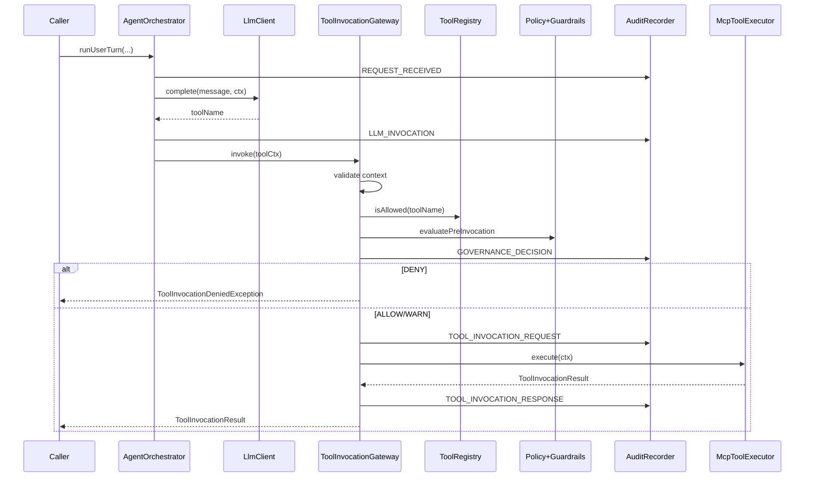

# AGC — detailed usage: features, sequence, data flow, storage, exceptions

This document explains **how to use each major feature**, the **order of operations**, **what data is passed where**, **what is persisted**, and **which exceptions appear** (and how `agc-api` maps them to HTTP).

For Maven naming and adoption context, see [LIBRARY.md](LIBRARY.md). For config reference and modules, see [ARCHITECTURE.md](ARCHITECTURE.md). For decision types and policy, see [GOVERNANCE.md](GOVERNANCE.md). For audit-mode behavior when the DB misbehaves, see [FAILURE_MODES.md](FAILURE_MODES.md).

---

## 1. Two ways to drive governed tool execution

| Path | When to use | Your code calls |
|------|-------------|-----------------|
| **A. REST + orchestrator** | Browser, Postman, or a service that only talks HTTP | `POST /agent/execute` (requires `agc-api`). The controller calls `AgentOrchestrator.runUserTurn(...)`, which calls the LLM stub/client, then `ToolInvocationGateway.invoke(...)`. |
| **B. Gateway only** | You already know the tool name (e.g. Spring AI callback, batch job, MCP bridge) | Inject `ToolInvocationGateway` and call `invoke(ToolInvocationContext)` with a fully built context (including `toolName` and optional `arguments`). |

Both paths end in **`DefaultToolInvocationGateway.invoke`** — the same governance pipeline, audit hooks, and `McpToolExecutor`.

---

## 2. The data object: `ToolInvocationContext`

Every governed invocation is described by a **`ToolInvocationContext`** (immutable record). Fields and how they flow:

| Field | Required | Meaning | Passed to |
|-------|----------|---------|-----------|
| `traceId` | Yes | Correlates **all** audit rows for one logical agent run | Gateway validation, audit rows, logs/MDC |
| `correlationId` | Yes* | Sub-span id; defaults to `traceId` if blank | Same as above |
| `tenantId` | No | Multi-tenant string; empty if null | Policy/guardrails if you use them; audit payload context |
| `principalId` | No | Acting user/service id | Policy (role resolution is separate); audit |
| `roles` | No | Set of role strings (lowercasing handled in policy layer as configured) | `PolicyEvaluator` / `GuardrailEvaluator` |
| `toolName` | Yes | Tool id, e.g. `search` or `search:v2` | Registry, pipeline, executor, audit |
| `arguments` | No | `Map<String,Object>` for the executor (JSON-friendly values) | Only your **`McpToolExecutor`** implementation (gateway does not interpret keys) |
| `deadline` | No | If set and passed, gateway can deny with `CONTEXT_DEADLINE` | `DefaultGovernancePipeline` |

\*REST **`/agent/execute`** requires both `traceId` and `correlationId` in the JSON body (controller validates before the orchestrator runs).

**Tool name rules:** must match `name` or `name:vN` (see `ToolNames.isValid`). Invalid names → **`InvalidGovernanceContextException`** at gateway entry.

**Version suffix:** `search:v2` is normalized to logical name `search` for **registry allowlist** matching; the **full** string is still passed to **`McpToolExecutor`** and audit.

---

## 3. Sequential flow (what runs in order)

### 3.1 Path A — `POST /agent/execute` → orchestrator → gateway

1. **Controller** checks `traceId`, `correlationId`; if `agc.governance.mode=PRODUCTION`, requires an authenticated Spring Security principal (`401` if missing).
2. **Principal/roles:** `TrustBoundaryPrincipalResolver` sets `principalId` and `roles` from the security context when authenticated; otherwise uses request body values (**development / untrusted**).
3. **`AgentOrchestrator.runUserTurn`**
   - Builds a context with **`toolName` empty** for the LLM step.
   - **Persists audit:** `REQUEST_RECEIVED` (payload summary = user message).
   - Calls **`LlmClient.complete(message, ctx)`** → returns planned **`toolName`** string.
   - **Persists audit:** `LLM_INVOCATION` (summary includes `plannedTool=...`).
   - Builds **`ToolInvocationContext`** with that `toolName` and **`arguments` empty** (orchestrator does not parse tool args from the message; you extend this in your app if needed).
   - Calls **`toolInvocationGateway.invoke(toolCtx)`** → section 3.2 below.

**Orchestrator-side persistence failures:** `auditRecorder.record` can throw **`AuditPersistenceException`**. The REST controller does **not** map that to a dedicated status; it typically becomes **500** via the generic `Exception` handler. For production, consider wrapping the orchestrator call or using resilient audit configuration.

**LLM failures:** `LlmClient` throws **`LlmException`** → REST **500** (generic handler).

### 3.2 Path B — direct `ToolInvocationGateway.invoke(ctx)`

Inside **`DefaultToolInvocationGateway.invoke`** (same for A and B after the orchestrator hands off):

1. **`GatewayInvocationConstraints.validate(ctx)`** — missing/invalid `traceId`, `correlationId`, or `toolName` → **`InvalidGovernanceContextException`**.
2. **MDC + metrics** — `traceId`, `correlationId`, `principalId`, `toolName` put on MDC for logging.
3. **`agc.enabled`** — if `false`, builds deny decision `AGC_DISABLED`, persists governed audit (per audit mode), throws **`ToolInvocationDeniedException`**.
4. **Tool registry** — if `agc.tools.allowed` is non-empty and logical name not allowed → deny `TOOL_NOT_REGISTERED`, audit, **`ToolInvocationDeniedException`**.
5. **Governance pipeline** — `DefaultGovernancePipeline.evaluatePreInvocation(ctx)`:
   - Deadline past → deny `CONTEXT_DEADLINE`.
   - **Policy** then **guardrails** (see [GOVERNANCE.md](GOVERNANCE.md)).
   - Uncaught runtime inside evaluators → deny `GOVERNANCE_EVALUATION_FAILED` (fail closed).
6. **Persist** `GOVERNANCE_DECISION` audit row (ALLOW/DENY/WARN) — behavior depends on **`agc.audit.mode`** (STRICT / ASYNC / BEST_EFFORT); on STRICT failure → **`GovernedPathAuditException`**.
7. If decision is **DENY** → **`ToolInvocationDeniedException`** (no executor).
8. If **ALLOW** or **WARN** (still execute): **Persist** `TOOL_INVOCATION_REQUEST`.
9. **`McpToolExecutor.execute(ctx)`** — must run only under gateway scope (`GatewayContextHolder`); your implementation reads **`ctx.arguments()`**, calls backends, returns **`ToolInvocationResult(success, outcomeSummary, duration)`**.
   - Throws **`ToolExecutionException`** → gateway records **`SYSTEM_ERROR`** audit (behavior depends on STRICT secondary audit — see [FAILURE_MODES.md](FAILURE_MODES.md)), then propagates **`ToolExecutionException`**.
10. On success: **Persist** `TOOL_INVOCATION_RESPONSE` with `outcomeSummary`.
11. **Return** `ToolInvocationResult` to caller.
12. **Finally:** clear MDC, exit gateway scope.

---

## 4. How data is stored (audit trail)

### 4.1 Who writes rows

- **Orchestrator:** `REQUEST_RECEIVED`, `LLM_INVOCATION` (synchronous `AuditRecorder.record`).
- **Gateway:** `GOVERNANCE_DECISION`, `TOOL_INVOCATION_REQUEST`, `TOOL_INVOCATION_RESPONSE`, and optionally `SYSTEM_ERROR` after tool failure.

### 4.2 Sequence numbers

`JpaAuditRecorder` assigns a monotonic **`sequenceNum` per `traceId`** via **`TraceSequenceAllocator`** so events are **ordered** for `GET /audit/{traceId}`.

### 4.3 What you read back

- **REST:** `GET /audit/{traceId}` returns `AuditEventEntity` list ordered by **`sequenceNum` ascending**.
- **Fields of interest:** `eventType`, `toolName`, `reasonCode`, `decisionType`, `payloadSummary`, `matchedRuleIds`, `createdAt`.

### 4.4 Payload limits and redaction

- **`agc.audit.max-payload-chars`** bounds stored summary text.
- Optional hashing: **`agc.audit.hash-payload`** (see properties class).

---

## 5. Feature-by-feature: how to use

### 5.1 Global kill switch — `agc.enabled`

- **`true` (default):** normal gateway behavior.
- **`false`:** every invocation denies with reason **`AGC_DISABLED`** after writing the governance decision audit (per audit mode).

### 5.2 Tool registry — `agc.tools.allowed`

- **Empty list:** no extra allowlist; policy/guardrails still run.
- **Non-empty:** tool’s **logical** name must appear (after `:vN` stripping). Otherwise **`TOOL_NOT_REGISTERED`** before policy.

### 5.3 Governance mode — `agc.governance.mode`

- **`DEVELOPMENT`:** REST may use body `principalId` / `roles` when not authenticated.
- **`PRODUCTION`:** `POST /agent/execute` requires a **non-anonymous** Spring Security authentication; principal and roles come from the security context.

### 5.4 Policy — `agc.policy.roles`

- Maps **role → allowed tool names** (and `*` for admin-style allow-all for that role).
- Evaluated in **`RoleToolPolicyEvaluator`**. Typical deny codes: **`POLICY_NO_ROLES`**, **`POLICY_TOOL_FORBIDDEN`**.

### 5.5 Guardrails — `agc.guardrails.rules`

- Ordered rules: match `toolName`, action **DENY** or **WARN**.
- **DENY** stops execution; reason codes like **`GUARDRAIL_<ruleId>`**.
- **WARN** still allows execution but decision is recorded (see [GOVERNANCE.md](GOVERNANCE.md)).

### 5.6 Audit modes — `agc.audit.mode`

| Mode | Governed-path write fails | Effect |
|------|---------------------------|--------|
| **STRICT** | Before or after tool (depending on phase) | **`GovernedPathAuditException`** — invocation aborts (fail closed). |
| **BEST_EFFORT** | Any | Logged warning; execution may continue (not for regulated production). |
| **ASYNC** | Enqueue fails | **`GovernedPathAuditException`**; if enqueue succeeds, failures logged async. |

Secondary audit after **`ToolExecutionException`:** controlled by **`agc.audit.strict-secondary-audit`** in STRICT mode (see [FAILURE_MODES.md](FAILURE_MODES.md)).

### 5.7 Custom tool execution — `McpToolExecutor` bean

- Provide a **`@Bean` of type `McpToolExecutor`** (demo: `DemoMcpToolExecutor`). With **`@Primary`**, it replaces the default echo executor.
- **Contract:** `execute(ToolInvocationContext ctx)` returns **`ToolInvocationResult`**. Use **`ctx.arguments()`** for structured inputs from your own API layer.
- **Security:** implement **`GatewayContextHolder.isGatewayCall()`** guard (as the default echo executor does) so the bean is not invoked directly by accident.
- **Note:** `McpToolExecutor` lives in **`com.framework.agent.mcp.internal`**; application modules that implement it may need ArchUnit exemptions (the demo package is exempt in this repo).

### 5.8 Custom LLM / planning — `LlmClient` bean

- Replace **`LlmClient`** with **`@Primary`** bean: receive `userMessage` + context (trace/tenant/principal/roles), return **tool name string** only in the stock orchestrator.
- If you need **arguments** in `ToolInvocationContext`, extend your flow: e.g. parse JSON from the model, then call **`ToolInvocationGateway.invoke`** yourself with a populated **`arguments`** map (bypassing the stock orchestrator for that turn).

### 5.9 Optional REST — `agc-api`

- Add dependency **`agc-api`**.
- **`POST /agent/execute`** body: `traceId`, `correlationId`, optional `tenantId`, `principalId`, `roles`, `message`.
- **`GET /audit/{traceId}`:** read-back for support and compliance debugging.

---

## 6. Exceptions reference (Java → HTTP for `agc-api`)

| Exception | When | Typical HTTP (`/agent/execute`) | Caller action |
|-----------|------|----------------------------------|---------------|
| **`ToolInvocationDeniedException`** | Registry, kill switch, policy, guardrails, deadline | **403** Problem Details: `decision`, `reasonCode`, `matchedRuleIds`, `traceId` | Do not run tool; show reason; same `traceId` for audit lookup |
| **`InvalidGovernanceContextException`** | Bad/missing context at controller or gateway validation | **400** | Fix request or build valid `ToolInvocationContext` |
| **`GovernedPathAuditException`** | Required audit write failed in STRICT (or strict secondary) | **503** | Retry or fix DB; see [FAILURE_MODES.md](FAILURE_MODES.md) |
| **`ToolExecutionException`** | Your `McpToolExecutor` failed the tool | **500** (generic handler) | Fix executor/backends; check `SYSTEM_ERROR` audit row if written |
| **`LlmException`** | `LlmClient.complete` failed | **500** | Fix LLM integration |
| **`AuditPersistenceException`** | Orchestrator audit record failed | **500** (generic) | Fix DB / transaction |
| **`Authentication` / `PRODUCTION`** | No authenticated user when mode is PRODUCTION | **401** | Authenticate before calling execute |

**Direct gateway use (no REST):** catch the same checked/runtime types in your service layer; map to gRPC/JSON-RPC errors as appropriate.

---

## 7. Passing data between steps (practical patterns)

1. **Same trace across services:** propagate **`traceId`** (and optionally **`correlationId`**) in HTTP headers or message metadata so all audit lines land in one timeline.
2. **Tool arguments:** only **`ToolInvocationContext.arguments`** reaches **`McpToolExecutor`**. The default orchestrator passes an **empty** map — populate arguments when **you** call the gateway (custom controller, MCP bridge, etc.).
3. **User message → tool:** default path uses **LLM output string** as **`toolName`** only. For rich args, use structured model output in your **`LlmClient`** implementation and then call **`invoke`** with a full context yourself.

---

## 8. Quick checklist for integrators

- [ ] Dependencies: **`agc-spring-boot-starter`** (+ **`agc-api`** if using REST).
- [ ] Datasource + Flyway + JPA (as in [QUICKSTART.md](QUICKSTART.md)).
- [ ] Configure **`agc.tools.allowed`**, **`agc.policy.roles`**, **`agc.guardrails.rules`**, **`agc.audit.mode`**.
- [ ] Implement **`McpToolExecutor`** for real backends.
- [ ] Replace or extend **`LlmClient`** if the stock stub is insufficient.
- [ ] Use **`PRODUCTION`** + Spring Security for real trust boundaries on REST.
- [ ] Query **`GET /audit/{traceId}`** after calls to verify sequence and denials.

---

## Related files (source of truth)

- Gateway: `DefaultToolInvocationGateway`, `GatewayInvocationConstraints`, `DefaultGovernancePipeline`
- REST: `AgentExecuteController`, `TrustBoundaryPrincipalResolver`
- Orchestrator: `AgentOrchestrator`
- Audit persistence: `JpaAuditRecorder`, `AuditEventEntity`
